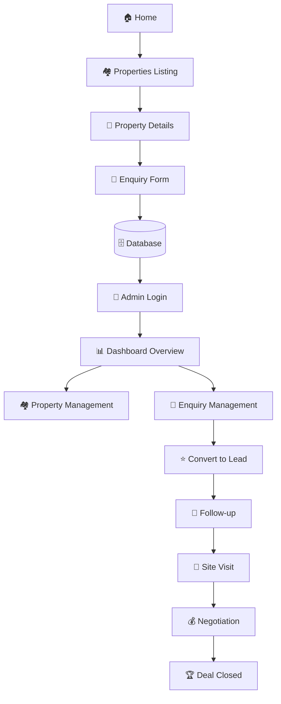
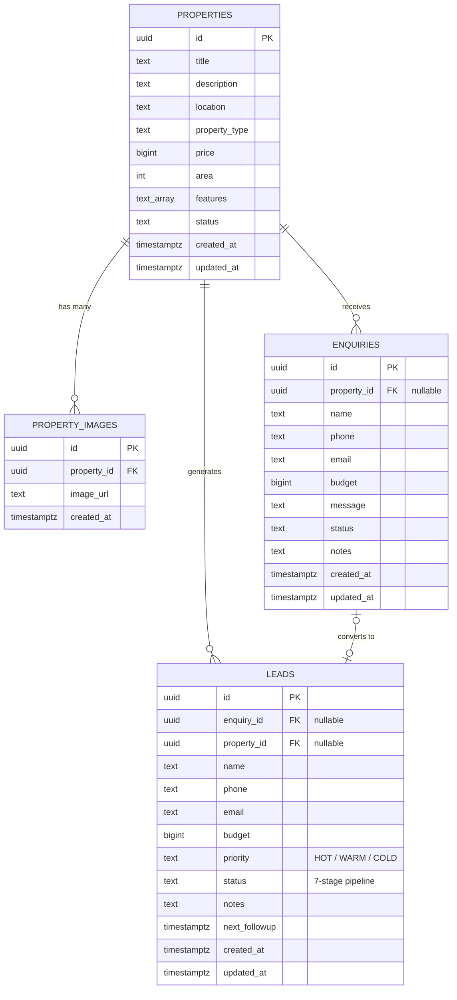

# 🏡 RRR Housing — Real Estate Business Platform

<p align="center">
  <a href="https://nextjs.org"></a>
  
  
  
  
</p>

<p align="center">
  <a href="https://vercel.com/new/clone?repository-url=https://github.com/Monsooroffc/Estate-hub-project">
    
  </a>
</p>

> **A production-ready, modern real-estate web application** for a family-owned property & land sales business — featuring a complete customer-facing website **and** a protected admin CRM dashboard in a single codebase.

> 🏢 **RRR Housing (Real Rise Resource)** — *Faith | Integrity | Truth* · RERA approved · DTCP & CMDA approved plots, flats & villas · ISO 27001:2013 certified · Porur, Chennai

---

## 📌 Overview

RRR Housing is a **one-application-two-experiences** platform:

| Experience | Audience | What it delivers |
|---|---|---|
| 🌐 **Customer Website** | Property buyers & investors | Browse listings, filter by location/budget/size, view galleries, submit enquiries |
| 🔐 **Admin Dashboard** (`/admin`) | Business owners | Manage properties, process enquiries, run a CRM lead pipeline from first contact to closed deal |

Built with a **Supabase-first architecture**: the app runs instantly on a built-in mock data layer, then upgrades to PostgreSQL + Auth + Storage by simply adding environment variables — **no rewrites required**.

---

## ✨ Features

### 🌐 Customer Experience

- **Home Page** — Hero section, business introduction, featured properties, property categories, location highlights, "Why Choose Us", enquiry CTA
- **Properties Listing** — Search + filters: location, property type, min/max budget, area size, availability
- **Property Details** — Image gallery, features list, pricing, availability status, map/location section
- **Enquiry Form** — Zod-validated, auto-associates the selected property, success feedback
- Fully **responsive** — mobile, tablet & desktop

### 🔐 Admin Experience (Protected)

- **Authentication** — Email/password login, route protection, logout (Supabase Auth-ready)
- **Dashboard** — 7 live KPI cards: Total/Available/Sold Properties, New Enquiries, Total Leads, Hot Leads, Follow-ups Due
- **Property Management** — Add, edit, delete, change availability, manage image galleries
- **Enquiry Management** — View details, update status, add notes, **convert enquiry → lead** in one click
- **Lead Management (CRM)** — Priority (HOT/WARM/COLD), 7-stage status pipeline, notes, next follow-up scheduling, search & filters

---

## 🔄 Application Flow

The complete business lifecycle — from a visitor's first click to a closed deal:



**Enquiry statuses:** `NEW → CONTACTED → FOLLOW_UP → SITE_VISIT → CLOSED`
**Lead pipeline:** `NEW → CONTACTED → FOLLOW_UP → SITE_VISIT → NEGOTIATION → WON / LOST`

---

## 🛠 Tech Stack

| Layer | Technology | Purpose |
|---|---|---|
| Framework | **Next.js 14** (App Router) | SSR, SSG, API routes, file-based routing |
| Language | **TypeScript** | End-to-end type safety |
| Styling | **Tailwind CSS** | Utility-first, responsive design system |
| UI | Custom shadcn/ui-compatible components | Consistent, reusable primitives |
| Icons | Lucide React | Modern SVG icon set |
| Validation | **Zod** | Schema validation for every form |
| Database | **Supabase PostgreSQL** | Managed Postgres with RLS |
| Auth | **Supabase Auth** | Email/password admin authentication |
| Storage | **Supabase Storage** | Property image hosting |
| Deployment | **Vercel** | Zero-config CI/CD for Next.js |

---

## 📂 Project Structure

```
estate-hub-project/
├── src/
│   ├── app/                     # Next.js App Router
│   │   ├── page.tsx             # 🏠 Home
│   │   ├── properties/          # 🏘️ Listing + [id] details page
│   │   ├── enquiry/             # 📝 Enquiry form page
│   │   └── admin/               # 🔐 Protected admin area
│   │       ├── login/           #    Admin sign-in
│   │       ├── page.tsx         #    Dashboard (KPI cards)
│   │       ├── properties/      #    Property CRUD + detail view
│   │       ├── enquiries/       #    Enquiry management + detail
│   │       └── leads/           #    CRM: list, detail, create
│   ├── components/
│   │   ├── admin/               # DashboardCard, DataTable, LeadTable, Modal…
│   │   ├── property/            # PropertyCard, PropertyGrid, Filters, Gallery, Form
│   │   ├── enquiry/             # EnquiryForm
│   │   ├── layout/              # Navbar, Footer, AdminSidebar
│   │   └── ui/                  # button, input, select, card, badge…
│   ├── hooks/                   # useAuth, useProperties
│   ├── lib/
│   │   ├── data/                # 🔄 Service layer: mock ↔ Supabase swap point
│   │   ├── supabase/            # Browser/server/middleware clients
│   │   ├── utils/               # Zod schemas, formatters
│   │   ├── ai/                  # 🤖 Future AI extension points
│   │   └── constants.ts         # Statuses, types, locations
│   ├── types/                   # Central TypeScript interfaces
│   └── middleware.ts            # Route protection & session refresh
├── .env.example                 # Environment variable template
└── package.json
```

---

## 🚀 Getting Started

### Prerequisites

| Requirement | Version |
|---|---|
| Node.js | 18+ |
| npm | 9+ |
| Git | latest |

### Installation

```bash
# 1. Clone the repository
git clone https://github.com/Monsooroffc/Estate-hub-project.git
cd Estate-hub-project

# 2. Install dependencies
npm install

# 3. Configure environment (optional for demo mode — see below)
cp .env.example .env.local

# 4. Start the development server
npm run dev
```

Open **http://localhost:3000** — the app runs immediately in **demo mode** with realistic mock data. No database required. 🎉

### Available Scripts

| Command | Description |
|---|---|
| `npm run dev` | Start development server with hot reload |
| `npm run build` | Create optimized production build |
| `npm start` | Serve the production build |
| `npm run lint` | Run ESLint checks |
| `npm run typecheck` | Validate TypeScript across the project |

### 🔑 Default Admin Access (Demo Mode)

| Field | Value |
|---|---|
| **URL** | `/admin/login` |
| **Email** | `admin@rrrhousing.in` (demo default) |
| **Password** | `admin123` (demo default) |

> Set your real credentials via `NEXT_PUBLIC_ADMIN_EMAIL` / `NEXT_PUBLIC_ADMIN_PASSWORD` in `.env.local` (gitignored — never committed). Real credentials are not stored anywhere in the repository. In production, replace mock auth with Supabase Auth.

---

## 🔐 Environment Variables

Create a `.env.local` file (never commit it — it's gitignored):

| Variable | Required | Description |
|---|---|---|
| `NEXT_PUBLIC_SUPABASE_URL` | When connecting Supabase | Your Supabase project URL |
| `NEXT_PUBLIC_SUPABASE_ANON_KEY` | When connecting Supabase | Public (anon) key — safe for the browser |
| `SUPABASE_SERVICE_ROLE_KEY` | Server-side ops only | ⚠️ Secret — **never** expose to the client |
| `NEXT_PUBLIC_ADMIN_EMAIL` | Optional | Demo admin email |
| `NEXT_PUBLIC_ADMIN_PASSWORD` | Optional | Demo admin password |

> **Security note:** only `NEXT_PUBLIC_*` variables reach the browser. All secret keys stay server-side.

---

## 🗄 Database Architecture

Designed for **Supabase PostgreSQL** with proper relationships and Row Level Security.



<details>
<summary><strong>📋 View full SQL schema (click to expand)</strong></summary>

```sql
-- Properties table
CREATE TABLE properties (
  id UUID PRIMARY KEY DEFAULT gen_random_uuid(),
  title TEXT NOT NULL,
  description TEXT NOT NULL,
  location TEXT NOT NULL,
  property_type TEXT NOT NULL,
  price BIGINT NOT NULL,
  area INT NOT NULL,
  features TEXT[],
  status TEXT NOT NULL DEFAULT 'available',
  created_at TIMESTAMPTZ DEFAULT NOW(),
  updated_at TIMESTAMPTZ DEFAULT NOW()
);

-- Property images table
CREATE TABLE property_images (
  id UUID PRIMARY KEY DEFAULT gen_random_uuid(),
  property_id UUID REFERENCES properties(id) ON DELETE CASCADE,
  image_url TEXT NOT NULL,
  created_at TIMESTAMPTZ DEFAULT NOW()
);

-- Enquiries table
CREATE TABLE enquiries (
  id UUID PRIMARY KEY DEFAULT gen_random_uuid(),
  property_id UUID REFERENCES properties(id) ON DELETE SET NULL,
  name TEXT NOT NULL,
  phone TEXT NOT NULL,
  email TEXT NOT NULL,
  budget BIGINT,
  message TEXT NOT NULL,
  status TEXT NOT NULL DEFAULT 'NEW',
  notes TEXT,
  created_at TIMESTAMPTZ DEFAULT NOW(),
  updated_at TIMESTAMPTZ DEFAULT NOW()
);

-- Leads table
CREATE TABLE leads (
  id UUID PRIMARY KEY DEFAULT gen_random_uuid(),
  enquiry_id UUID REFERENCES enquiries(id) ON DELETE SET NULL,
  property_id UUID REFERENCES properties(id) ON DELETE SET NULL,
  name TEXT NOT NULL,
  phone TEXT NOT NULL,
  email TEXT NOT NULL,
  budget BIGINT,
  priority TEXT NOT NULL DEFAULT 'WARM',
  status TEXT NOT NULL DEFAULT 'NEW',
  notes TEXT,
  next_followup TIMESTAMPTZ,
  created_at TIMESTAMPTZ DEFAULT NOW(),
  updated_at TIMESTAMPTZ DEFAULT NOW()
);

-- Row Level Security example (properties)
ALTER TABLE properties ENABLE ROW LEVEL SECURITY;

CREATE POLICY "Allow public read" ON properties
  FOR SELECT USING (true);

CREATE POLICY "Allow admin write" ON properties
  FOR ALL USING (auth.role() = 'authenticated')
  WITH CHECK (auth.role() = 'authenticated');
```

> Repeat the RLS pattern for `enquiries` and `leads` — public can **submit** enquiries, only **authenticated** admins can read/update.

</details>

---

## 🔌 Connecting Supabase

The app ships with a **drop-in data service layer** — swapping mock data for a live database takes ~15 minutes:

| Step | Action |
|---|---|
| **1** | Create a project at [supabase.com](https://supabase.com) |
| **2** | Open **SQL Editor** and run the schema above |
| **3** | Copy your project URL + anon key into `.env.local` |
| **4** | In `src/lib/data/`, replace mock function bodies with `supabase.from(...)` calls (equivalent queries are commented inline in every function) |
| **5** | In `src/hooks/useAuth.ts` and `src/middleware.ts`, uncomment the Supabase Auth blocks for real authentication |

---

## 🏗 Architecture & Code Quality

The codebase follows a strict separation of concerns so every layer can evolve independently:

```
UI Components (src/components)
        ↓ renders
Pages / Routes (src/app)
        ↓ calls
Custom Hooks (src/hooks)          ← client-side state & data fetching
        ↓ calls
Data Service Layer (src/lib/data) ← 🔄 single swap point: mock ↔ Supabase
        ↓
Types & Validation (src/types, src/lib/utils)
```

**Principles enforced throughout:**

- ✅ **No business logic in components** — UI stays presentational
- ✅ **No hard-coded data** — all data flows through the service layer
- ✅ **Validated forms** — every input guarded by a Zod schema
- ✅ **Reusable components** — DataTable, Modal, StatusBadge, PropertyCard, etc.
- ✅ **Organized types** — single source of truth in `src/types`
- ✅ **Secret hygiene** — credentials only via environment variables

---

## 🤖 AI-Ready Architecture

AI features are **intentionally not implemented** in v1 — but clean extension points already exist in `src/lib/ai/`, so they can be added without refactoring:

| Future Module | File Hook | What it will do |
|---|---|---|
| AI Lead Scoring | `scoring.ts` | Rank leads by conversion likelihood |
| Property Recommendations | `recommendations.ts` | Match enquiries to best-fit listings |
| Customer Chatbot | `chatbot.ts` | Answer buyer questions 24/7 |
| Enquiry Summarization | `summarizer.ts` | Condense long enquiries for quick review |
| Follow-up Suggestions | `followups.ts` | Recommend optimal follow-up timing & templates |
| Marketing Content Generation | `marketing.ts` | Auto-generate listing descriptions & posts |

---

## 🚢 Deployment

### Deploy to Vercel (recommended)

[](https://vercel.com/new/clone?repository-url=https://github.com/Monsooroffc/Estate-hub-project)

**Manual steps:**

1. Push your code to GitHub (done ✅ — this repo)
2. Import the project at [vercel.com/new](https://vercel.com/new)
3. Vercel auto-detects Next.js — click **Deploy**
4. (After connecting Supabase) add environment variables in **Settings → Environment Variables**, then redeploy

### Verify a production build locally

```bash
npm run build
npm start
```

---

## 🗺 Roadmap

- [x] Customer website — listing, filtering, details, enquiry
- [x] Admin dashboard — properties, enquiries, lead CRM
- [x] Enquiry → Lead conversion
- [x] Follow-up scheduling & reminders (due counter)
- [ ] Supabase production connection (schema ready — see guide above)
- [ ] Supabase Storage image uploads
- [ ] WhatsApp / email notifications on new enquiries
- [ ] AI modules (see AI-Ready Architecture)

---

## 📄 License

This project is provided as a starter template for your real-estate business. Modify and use it as needed.

---

## 🙌 Support

Built with ❤️ for **RRR Housing (Real Rise Resource)** — *Faith | Integrity | Truth*.

**📍 RRR Housing** · No.100/5, 2nd Floor, Lakshmi Nagar, 1st Main Road, Porur, Chennai - 600116
**📞** +91 99627 82486 · **✉️** abithabegum52143@gmail.com

**Useful resources:**

- [Next.js Documentation](https://nextjs.org/docs)
- [Supabase Documentation](https://supabase.com/docs)
- [Vercel Documentation](https://vercel.com/docs)
- [Tailwind CSS Documentation](https://tailwindcss.com/docs)

---

<p align="center">
  <sub>🏡 RRR Housing — from first enquiry to closed deal.</sub>
</p>


